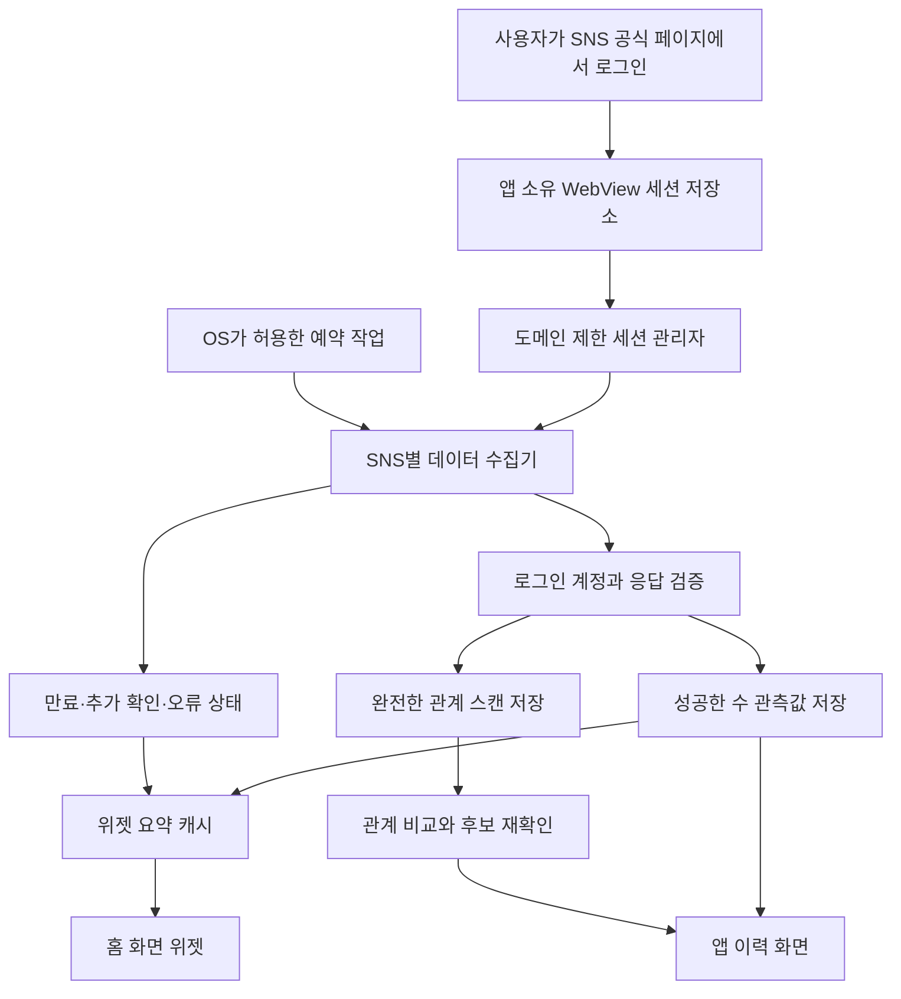

# 팔로워 트래커 구현 계획서

작성일: 2026-10-01, Asia/Seoul

상태: 구현 진행 중. SNS별 실기기 세션 수집은 아직 검증되지 않았다. 현재 작업과 검증 결과는 [구현 기록](WORK_LOG.md)에 남긴다.

근거: [구현 가능성 조사](FEASIBILITY.md)

## 1. 제품 목표와 완료 기준

휴대폰 안에서 사용자가 SNS에 로그인하면 앱이 해당 세션으로 자기 계정의 팔로워 데이터를 읽는다. 기록을 기기에 저장하고, 앱과 홈 화면 위젯에서 수·증감·마지막 수집 시각을 보여준다. 명단을 완전하게 읽을 수 있는 SNS에서는 언팔로우 추정과 맞팔 상태도 제공한다.

제품 기능은 모두 무료로 제공한다. 구독·기능 잠금·유료 API를 필수 경로로 두지 않는다. 사용자의 세션이나 관계 명단을 수집하는 서버 없이 설계한다.

완료 기준은 실제 계정의 데이터가 실제 기기 위젯에 표시되는 것이다. 화면 샘플, 목 데이터, 쿠키 조회 성공만으로 수집 완료라고 보고하지 않는다. 전경에서 수집한 값을 표시하는 것과 앱을 열지 않아도 새 데이터를 수집하는 것을 별도로 검증한다.

## 2. 지원 범위와 진행 순서

Android와 iOS를 모두 목표로 한다. **Android에서 첫 수집기를 검증하고 iOS의 같은 경로를 바로 교차 검증하는 순서를 권장한다.** 이는 현재의 계획 제안이며, 사용자에게 특정 OS 출시 순서를 확정받은 상태는 아니다.

첫 SNS 후보는 Instagram이다. 로컬 WebView 분석을 설명하는 선행 앱이 있어 비교할 대상이 있지만, 이것이 우리의 수집 경로가 작동한다는 증거는 아니다. Instagram에 집중해 모든 UI를 만들기 전에 TikTok·X·Facebook·Reddit의 데이터 접근도 짧게 평가한다. 한 SNS만 성공한 결과를 다섯 SNS의 성공으로 확대하지 않는다.

초기 범위는 SNS별 계정 1개다. Facebook은 개인 프로필·프로페셔널 모드·페이지를 별도 계정 유형으로 취급한다. 같은 SNS의 다중 계정은 쿠키 저장소 격리와 계정 전환 검증 후 추가한다. Android에서 WebView 객체를 여러 개 만드는 것만으로 세션이 격리된다고 가정하지 않는다.

| 단계 | 결과물 | 다음 단계로 넘어가는 조건 |
| --- | --- | --- |
| A. 데이터 접근 검증 | SNS별 실제 수집 경로와 기능 표, Android/iOS 검증 기록 | 최소 한 SNS의 정확한 수와 네이티브 세션 요청 성공. 실패한 SNS도 이유와 재현 조건 기록. |
| B. 추적·위젯 MVP | 로그인, 로컬 이력, 증감, 위젯, 재로그인과 오류 처리 | 실기기에서 앱을 열지 않은 동안의 갱신을 관찰하고 한계를 설명할 수 있음. |
| C. 관계 분석 | 명단 동기화, 언팔로우 추정, 맞팔 분석 | 해당 SNS의 전체 명단과 계정 식별자·비교 정확성 검증 통과. |
| D. 플랫폼 확장·배포 준비 | 다른 SNS 수집기, 개인정보 설명, 심사 자료 | 플랫폼별 기술 검증과 서비스 허용 범위 확인. 공개 배포는 별도 작업으로 진행. |

기술 검증에 실패한 플랫폼을 목 데이터로 지원하는 것처럼 보이게 하지 않는다. 수동 데이터 파일 가져오기는 추후 선택 기능이 될 수 있으나, 로그인 세션 자동 수집 요구사항을 대신 충족한 것으로 처리하지 않는다.

## 3. 적용한 기술 구성

빈 저장소에서 시작한 초기 제안을 구현에 적용했다. Android 앱은 Kotlin·Compose, iOS 앱은 SwiftUI를 사용하며, 로그인 세션·예약 수집·위젯은 각 운영체제의 네이티브 기능으로 구성한다. 버전과 실행 명령은 [개발 문서](DEVELOPMENT.md), 실제 검증 상태는 [구현 기록](WORK_LOG.md)에 남긴다.

| 영역 | Android | iOS |
| --- | --- | --- |
| 앱 화면 | Kotlin, Jetpack Compose | Swift, SwiftUI |
| 로그인 | 앱 소유 WebView, CookieManager | WKWebView, WKHTTPCookieStore |
| 데이터 요청 | 네이티브 HTTP 클라이언트와 URL별 세션 처리 | URLSession과 도메인별 쿠키 처리 |
| 로컬 기록 | Room 기반 앱 전용 DB | SQLite 기반 앱 전용 DB |
| 세션 보호 | CookieManager의 앱 전용 WebView 저장소, 추가 메타데이터는 Keystore로 암호화 | Keychain, 앱·위젯 공유 접근 그룹 |
| 홈 화면 위젯 | Jetpack Glance/AppWidget | WidgetKit |
| 예약 수집 | WorkManager | WidgetKit 타임라인의 제한된 네트워크 요청, 필요한 경우 앱 백그라운드 작업 평가 |
| 앱·위젯 데이터 전달 | Room의 수치·상태를 읽어 위젯에 전달 | App Group의 SQLite에서 수치·상태 조회, 비밀정보는 Keychain |

로그인·요청·백그라운드·위젯의 운영체제별 동작을 직접 검증하기 위해 두 앱을 네이티브로 구성했다. 기기에 포함한 공통 JavaScript는 로그인 후 자기 프로필의 공개 화면 정보를 읽는 경로에만 사용한다. 테스트에서 얻은 결과를 실제 SNS 지원으로 확대하지 않는다.

운영체제 근거: [Android CookieManager](https://developer.android.com/reference/android/webkit/CookieManager), [Apple 쿠키 저장소](https://developer.apple.com/documentation/webkit/wkhttpcookiestore/getallcookies%28_%3A%29), [Keychain 공유](https://developer.apple.com/documentation/security/sharing-access-to-keychain-items-among-a-collection-of-apps)

## 4. 데이터 흐름과 모듈 경계

`SessionManager`는 SNS별 로그인 상태와 비밀정보를 관리한다. 수집기는 이 관리자를 통해 허용된 SNS 목적지에 요청하며, 화면·로그·분석 모듈에 원시 쿠키를 전달하지 않는다. 쿠키 갱신 응답도 도메인과 계정에 맞게 저장하고 다음 전경 로그인과 상태가 어긋나지 않도록 한다.

`ProviderAdapter`는 계정 확인, 수 수집, 팔로워 페이지, 팔로잉 페이지, 완료 판정을 각각 제공한다. 응답 규격과 수집기 버전을 기록하고, 지원되지 않는 기능은 명시적인 상태를 반환한다. 응답 변경을 빈 명단이나 0명으로 처리하지 않는다.

`SyncCoordinator`는 동일 계정의 중복 실행을 막고, 수·명단 작업을 따로 예약한다. 성공 데이터만 트랜잭션으로 확정한다. `RelationshipAnalyzer`는 확정된 명단만 비교하며, `WidgetPublisher`는 비밀정보 없는 요약을 전달한다.

수집기가 브라우저에서만 동작하면 `foreground-only`로 기록한다. 백그라운드에서 숨겨진 WebView를 계속 유지하는 구조로 운영체제 제약을 해결했다고 간주하지 않는다.

## 5. 로그인과 세션 처리

1. 연결할 SNS를 고르면 세션을 기기에 보관하며 SNS 데이터 읽기에 사용한다는 범위를 설명한다.
2. 공식 SNS 로그인 페이지를 앱 소유 WebView에서 연다. 비밀번호와 추가 인증은 사용자가 해당 페이지에서 직접 입력한다.
3. 로그인 화면의 필드 값을 읽거나 가로채는 코드를 넣지 않는다. 로그인 이후 읽기 요청으로 실제 계정 ID와 연결 상태를 확인한다.
4. OS의 WebView 저장소에서 대상 URL에 필요한 세션을 얻는다. 모든 SNS의 쿠키를 하나의 공용 요청 헤더로 합치지 않는다.
5. 허용 도메인·경로·HTTPS·만료·리다이렉트 범위를 지키는 네이티브 요청을 시도한다. 쿠키만으로 부족한 요청은 추가 상태의 필요성을 검증 기록에 남긴다.
6. WebView를 종료하고 앱을 백그라운드로 이동한 뒤 동일 요청을 다시 시험한다. 이것을 통과해야 백그라운드 수집 후보로 표시한다.
7. 세션 만료나 확인 화면이 감지되면 자동 재시도를 멈추고 마지막 성공값과 `다시 로그인 필요`를 표시한다.

SNS 기본 로그인과 외부 계정 연동 로그인은 별도로 시험한다. 외부 브라우저 기반 인증이 필요한 경우, 그것이 쿠키를 앱에 전달하는 방법이 되는지는 별도의 문제다. [RFC 8252](https://www.rfc-editor.org/rfc/rfc8252)

앱이 추가로 보관하는 세션 사본은 보호된 저장소에 둔다. 세션과 명단이 OS 백업·진단 로그·오류 보고에 포함되지 않도록 설정한다. WebView 자체의 저장소 동작도 확인하며 모든 OS 저장 데이터가 자동으로 암호화된다고 가정하지 않는다. 연결 해제 시에는 대상 SNS와 계정의 데이터만 지우는 사용자 기능을 제공한다. 전역 쿠키 초기화로 다른 SNS 연결을 잃게 해서는 안 된다.

## 6. 최소 데이터 모델

| 모델 | 주요 필드 | 필요한 이유 |
| --- | --- | --- |
| `ConnectedAccount` | provider, accountType, stableAccountId, username, sessionReference, capabilities, adapterVersion | 이름 변경·계정 전환으로 다른 명단을 비교하는 것을 방지한다. |
| `MetricSnapshot` | accountId, observedAt, followersCount, followingCount, precision, source, adapterVersion | 정확·축약·추정 수치를 구분하고 실제 관측 이력을 저장한다. |
| `RelationshipScan` | accountId, direction, startedAt, finishedAt, status, endReason, memberCount, consistency, adapterVersion | 완료·실패·불안정한 스캔을 구분한다. |
| `RelationshipMember` | scanId, providerUserId, usernameAtObservation | 가능한 경우 안정적인 ID로 비교한다. |
| `RelationshipChange` | accountId, userId, previousScanId, currentScanId, candidateOrConfirmed, detectedAt | 근거 스캔과 이탈 후보의 재확인 상태를 남긴다. 원인을 확정했다는 뜻은 아니다. |
| `WidgetSummary` | schemaVersion, accountId, displayCount, change, comparisonAt, lastSuccessAt, syncStatus | 위젯에 필요한 최소 데이터만 전달한다. |

시각은 UTC로 저장하고 사용자 시간대로 표시한다. 증감에는 실제 비교 시점을 표시한다. 이력이 충분하지 않은데 `지난 24시간`의 변화를 만들어내지 않는다. 비밀정보는 관계·수치 테이블과 분리한다. 관계 명단은 앱 전용 저장소에서 보호하고, 위젯에는 공개 화면에 필요한 수치만 노출한다.

## 7. 관계 분석의 확정 조건

명단 수집은 수집 중 페이지를 임시 저장하고 다음 조건을 만족할 때만 완료 상태로 확정한다.

- 수집 시작과 끝의 로그인 계정 ID가 같다.
- 페이지 커서가 진행했고 정상 종료 조건을 확인했다.
- 인증 오류·취소·제한 응답·파싱 오류가 없다.
- 중복 계정 ID를 제거했으며 지원 경로의 페이지 제한을 확인했다.
- 표시 수와 수집 수가 다를 때 서비스 필터링·축약 등 원인을 평가했다. 수가 같다는 사실만으로 완전성을 판단하지 않는다.
- 동시점 스냅샷을 제공하지 않는 경로는 수집 중 변경 가능성을 기록한다. 불안정한 스캔은 비교 대상에서 제외한다.

완료된 팔로워 명단 두 개의 차이로 이탈 후보를 만들고, 필요한 경우 다음 정상 스캔에서 재확인한다. 맞팔은 동일 계정에서 비슷한 시점에 완료된 팔로워·팔로잉 명단으로 계산한다. ID가 없는 경로는 이름 변경의 영향을 평가하기 전까지 정확한 관계 분석 지원으로 표시하지 않는다.

첫 스캔에는 `기준 기록 생성`을 보여준다. 부분 실패 때는 이전 정상 기록을 유지하고 `명단 갱신 미완료`를 표시한다. 사람을 대량으로 언팔로우하는 자동 작업은 이 앱의 요청 범위에 포함되지 않는다.

## 8. 위젯과 사용자 화면

첫 화면은 SNS별 계정 카드, 현재 팔로워 수, 비교 가능한 최근 증감, 마지막 수집 시각을 보여준다. 계정 상세에서 이력 그래프와 지원되는 관계 분석으로 이동한다. 연결 화면에는 플랫폼별 지원 상태와 재로그인 경로를 제공한다.

첫 위젯은 계정 한 개를 보여주는 작은 크기와 여러 SNS를 보여주는 중간 크기를 계획한다. 로그인 비밀정보와 사람별 명단은 위젯 캐시에 넣지 않는다. `42분 전 갱신`, `다시 로그인 필요`, `연결 확인 필요`처럼 짧게 상태를 보여준다.

핵심 검증은 앱 화면을 닫고 짧은 간격으로 새 팔로워 수를 확보해 홈 화면 위젯에 반영하는 동작이다. Android 일반 예약은 15·30·60·120분 중 선택한다. 실행 시각은 OS가 정하므로 정확한 15분 주기를 보장하지 않는다. 별도 `1분 빠른 추적`은 사용자가 앱에서 시작하는 알림이 있는 `dataSync` 전경 서비스로 구현한다. 현재 대상은 Instagram이며 한 번에 최대 약 6시간 실행한다. Android 15 이상 실행 시간 제한과 절전·네트워크·SNS 요청 제한을 적용하고, 제한이 발생하면 대기하거나 중지한다. 부팅·강제 중지 뒤 임의로 재시작하거나 24시간 1분 갱신을 보장하지 않는다. [WorkManager 최소 간격](https://developer.android.com/develop/background-work/background-tasks/persistent/getting-started/define-work), [전경 서비스 시간 제한](https://developer.android.com/develop/background-work/services/fgs/timeout)

Instagram 프로필 화면에서 연결한 계정은 로그인 시의 CookieManager·사용자 에이전트로 공식 본인 프로필을 새로 로드한다. 정확한 본인 수치가 확인된 경우에만 관측 기록을 저장하고 위젯 갱신을 요청한다. 페이지 캐시·기존 DOM·저장된 숫자에 새 시각을 붙여 수집 성공으로 처리하지 않는다. 이 프로필 브라우저는 요청마다 정리하며 빠른 모드를 무제한 숨겨진 WebView 상주로 설명하지 않는다. 성공한 모드와 실제 기기 상태는 [기기 검증](DEVICE_VALIDATION.md)에 기록한다. 일반 예약·Doze·실기기의 동일 성공은 별도 검증한다.

명단은 수동 요청과 하루 단위 예약부터 평가한다. 위젯에는 마지막 실제 수집 시각과 오류 상태를 표시하며, 새 기록을 저장한 직후 갱신을 요청한다. iOS 위젯과 Android 일반 위젯 타이머를 1분 갱신 수단으로 설명하지 않는다. [Android 위젯](https://developer.android.com/develop/ui/views/appwidgets/advanced), [WidgetKit 갱신](https://developer.apple.com/documentation/widgetkit/keeping-a-widget-up-to-date)

iOS에서는 앱이 갱신한 요약을 App Group으로 전달하고 타임라인 갱신을 요청한다. 위젯 확장에서도 네이티브 수 수집을 수행할 수 있는지 시험한다. Keychain 접근, 잠금 상태, 요청 시간 제한을 통과한 플랫폼만 이 경로를 사용한다. 상시 실행 또는 서버 푸시를 기본 전제로 두지 않는다.

로컬 전용 기록은 다른 기기와 자동 공유되지 않는다. 앱 삭제나 기기 교체에 따른 기록 보존은 향후 사용자가 직접 내보내는 기능으로 검토한다. 이를 위해 자동 서버 업로드를 도입하지 않는다.

## 9. 실패 상태와 재시도

| 상태 | 앱·위젯 처리 | 재시도 원칙 |
| --- | --- | --- |
| 네트워크 단절·일시적 서버 오류 | 마지막 성공값과 수집 시각 유지 | 지연을 늘려 재시도하며 다음 예약과 중복 실행하지 않는다. |
| HTTP 429 등 요청 제한 | 갱신 지연 상태 표시 | 서비스가 제시한 재시도 조건을 존중한다. |
| 로그인 만료·계정 추가 확인 | 다시 로그인 필요 | 자동 요청 중단, 공식 로그인 화면으로 안내한다. |
| HTTP 403·서비스 확인 화면 | 연결 확인 필요 | 무조건 세션 만료로 단정하지 않는다. 제한·확인 상태를 구분하고 반복 수집을 중단한다. |
| 응답 형식 변경 | 수집기 확인 필요 | 0명·빈 명단으로 저장하지 않고 수집기 버전과 비밀정보 없는 오류 종류를 남긴다. |
| 명단 페이지 일부 실패 | 명단 갱신 미완료 | 이전 완전한 명단을 보존하고 언팔로우 비교를 실행하지 않는다. |
| 로그인 계정 변경 | 연결한 계정 확인 필요 | 이전 계정과 새 계정의 이력을 합치지 않는다. |

## 10. 기술 검증과 테스트 계획

### A. 플랫폼별 실기기 PoC

SNS 다섯 개 각각에 대해 아래 표를 Android와 iOS에서 채운다. 검증에 쓸 계정은 사용자가 직접 로그인한 자기 계정이어야 한다. 기록에는 실제 쿠키·비밀번호·원시 개인 명단을 포함하지 않는다.

| 검증 항목 | 성공 판정 | 남길 증거 |
| --- | --- | --- |
| 로그인 | 공식 페이지에서 로그인 후 실제 계정 ID 확인 | OS/앱/WebView 버전, 계정 유형, 익명화한 결과 |
| 정확한 수 | 같은 시점 공식 화면의 수와 비교, 축약 여부 구분 | 수집 방식과 정밀도, 측정 시각 |
| 네이티브 요청 | WebView 종료 후에도 해당 계정 데이터를 읽음 | 전경/백그라운드 결과와 오류 종류 |
| 세션 지속 | 앱 재실행·기기 재시작 후 저장 정책대로 동작 | 유지·만료·재로그인 결과 |
| 전체 명단 | 한 페이지를 넘는 목록에서 정상 종료 확인 | 페이지 수, 중복·누락 평가, 완료 판정 근거 |
| 관계 비교 | 통제된 팔로우·언팔로우 변화가 정상 스캔에서 반영 | 익명화한 ID 변화와 비교 시각 |
| 위젯 자동 갱신 | 앱을 열지 않은 동안 실제 새 수치 관측 | 요청 시각과 실제 수집/위젯 갱신 시각 |

팔로우·언팔로우를 사용하는 검증은 참여 계정의 동의를 갖춘 수동 시험으로 진행한다. 관계 변경 작업을 일반 사용자 계정에서 자동 실행하는 테스트를 만들지 않는다.

### B. 실제 기기 운영 시나리오

최소 24시간 관찰로 전경·백그라운드 차이를 확인하고 출시 후보는 72시간 이상 관찰한다. 화면 잠금, 앱 종료, 네트워크 단절과 복귀, 배터리 절약, Android Doze·강제 중지, iOS 앱 강제 종료와 위젯 갱신을 별도 기록한다. 일반적인 앱 종료와 OS의 강제 중지를 같은 상태로 취급하지 않는다. 갱신 지연을 숨기지 않고 측정 결과를 지원 안내에 반영한다.

명단은 빈 계정, 한 페이지 계정, 여러 페이지 계정에서 확인한다. 공개 지원 최대 규모는 실제 시간·메모리·요청 수 측정 후 결정한다. 매우 큰 명단과 계속 관계가 변하는 계정까지 지원한다고 미리 약속하지 않는다.

### C. 구현 코드에 필요한 검사

- 관계 비교: 이름 변경, 첫 스캔, 부분 실패, 중복 페이지, 반복 커서, 계정 전환, 이탈 후보 재확인.
- 응답 처리: 로그인 HTML·확인 화면·권한 오류·429·형식 변경을 성공 데이터로 오인하지 않는지.
- 세션 요청: 쿠키가 잘못된 SNS나 리다이렉트 목적지로 전달되지 않는지, 만료·갱신·연결 해제가 계정별로 동작하는지.
- 저장·위젯: 트랜잭션 실패 시 정상값 보존, 오래된 캐시·새 캐시 버전 처리, 로그인 만료 상태 표시.
- 빌드·정적 검사와 실제 앱·위젯 화면 및 주요 상호작용 확인.

테스트용 응답은 합성 데이터 또는 개인정보를 제거한 최소 데이터만 사용한다. 실제 세션과 개인 명단을 fixture·로그·커밋에 넣지 않는다.

## 11. SNS별 작업 목록과 지원 확정

| SNS | 먼저 해결할 질문 | 지원을 확정할 때 필요한 결과 |
| --- | --- | --- |
| Instagram | 일반·프로페셔널 계정의 자체 로그인, 네이티브 수집, 명단 페이지 처리 | 계정 유형별 수·백그라운드·전체 명단 검증과 자동 수집 허용 범위 |
| TikTok | 한국 계정의 웹 로그인과 수·명단 접근이 각각 가능한가 | 지역별 결과, 수집 경로와 종료 조건, 서비스 허용 범위 |
| X | 유료 공식 API 없이 자기 계정의 데이터를 읽는 경로가 작동하며 허용되는가 | 종량 과금 API 의존 없는 경로의 검증과 플랫폼 권한 검토 |
| Facebook | 개인 프로필·프로페셔널 모드·페이지 중 어느 대상을 지원할 수 있는가 | 대상별 팔로워 의미, 수·명단·권한 범위 확인 |
| Reddit | 자기 프로필 팔로워와 사용자 팔로잉을 구분해 얻을 수 있는가 | 개인 관계 데이터의 접근·완전성 및 플랫폼 허용 범위 |

각 수집기는 `count`, `followers`, `following`, `background` 기능을 `미검증/검증 성공/전경 전용/사용 불가`로 기록한다. 공개 지원표는 성공한 기능만 반영한다. 서비스가 허용하지 않거나 접근이 해결되지 않은 플랫폼을 그대로 출시 범위에 포함하지 않는다.

## 12. 배포 준비와 저장소 작업

공개 배포 전에 세션을 이용하는 구체적인 경로가 각 서비스의 조건에 부합하는지 확인한다. Apple은 외부 서비스 접근의 허용 근거를 요구할 수 있고, Google Play는 실제 사용자 데이터 처리와 공개 설명의 일치를 요구한다. [Apple 심사 규칙](https://developer.apple.com/app-store/review/guidelines/), [Google Play 사용자 데이터 정책](https://support.google.com/googleplay/android-developer/answer/10144311?hl=en)

서버에 쿠키를 보내지 않는다는 사실, 기기에 보관하는 데이터, 연결 해제 방법, 지원 기능과 갱신 한계를 개인정보 설명과 심사 메모에 일치시킨다. 개인정보 설명은 실제 구현 후 작성·검증한다. 웹 응답 변경에 대응하는 수집기 코드는 앱에 포함하고, 임의의 실행 코드를 원격 다운로드하는 방식으로 심사와 업데이트 절차를 대체하지 않는다.

구현 시에는 검토 가능한 작은 변경으로 진행한다. 런타임·패키지 버전을 확정하고 manifest와 lockfile을 함께 관리하며 필요한 CI를 구성한다. 커밋·PR 작업이 요청되면 `/Users/yeoreum/.codex/guidelines/COMMITS.md`와 `PULL_REQUESTS.md`를 작업 기준으로 확인한다. 지속적인 PR 확인이 요청되면 `PR_MONITORING.md`를 적용한다. 초기 조사 이후 사용자가 완전한 구현과 단계별 커밋·push를 요청했으므로 현재 구현에는 이를 적용한다. 병합·스토어 제출·배포는 별도 요청 범위다.

## 13. 일정 추정과 중단 조건

1인 개발 기준의 초기 추정이며, 수집 경로를 아직 검증하지 않았으므로 확정 일정이 아니다.

| 작업 | 예상 작업량 | 불확실성 |
| --- | --- | --- |
| 첫 SNS와 OS별 세션·수·명단·위젯 PoC | 약 1~2주 | 로그인 가능 여부, 요청 재사용, 전체 명단 접근 |
| 검증된 SNS의 Android 추적·위젯 MVP | 약 2~3주 | 저장·재시도·전원 관리·기기별 차이 |
| 같은 범위의 iOS MVP | 약 2~3주 | 확장 세션 공유·잠금·위젯 갱신 측정 |
| 첫 SNS 관계 분석 안정화 | 약 1~2주 | ID 안정성·명단 완전성·수집 중 변경 |
| 다른 SNS 확장, 서비스 허용 확인, 스토어 심사 | 별도 산정 | 앞 단계의 기간만으로 다섯 SNS 출시일을 계산할 수 없음 |

첫 후보에서 정확한 수와 백그라운드 수집을 확인하지 못하면 위젯 UI 개발만 계속해 자동 추적이 된다고 보고하지 않는다. 다음 후보를 검증하거나 지원 범위 변경이 필요한 결과를 사용자에게 제시한다. 어떤 플랫폼에서도 요구한 수집 경로를 확보하지 못하면 그 조건으로는 제품을 완성할 수 없다는 결론을 기록한다.

**다음 구현 작업의 첫 결과물은 실제 휴대폰에서 한 SNS의 로그인 → 정확한 수 수집 → WebView 종료 후 재수집 → 위젯 갱신을 확인한 기록이다.** 그 결과로 출시 범위와 나머지 일정을 조정한다.
